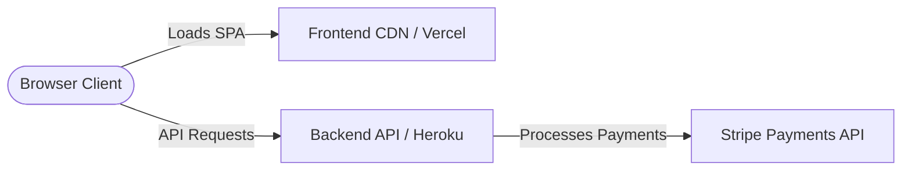
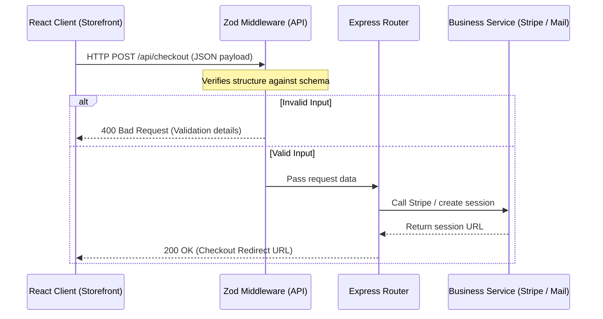

# 📐 Project Architecture & System Design

This document details the system design, directory structures, data flow, security models, and performance considerations of the **OHANNA** Egyptian Streetwear e-commerce platform.

---

## 🎯 Architecture Overview

OHANNA is designed as a modular, decoupled full-stack application. It consists of:
1. **Frontend Storefront**: A responsive Single Page Application (SPA) built with React, Vite, and Tailwind CSS.
2. **Backend API Gateway**: A RESTful HTTP API built with Express.js and TypeScript, handling business logic, order tracking, contact forms, and Stripe integrations.



For information on setting up the local environment or deploying the app to production, refer directly to:
* 🛠️ **[Local Development Setup Guide](./SETUP.md)**
* 🚀 **[Production Deployment & Operations Guide](./DEPLOYMENT.md)**

---

## 📁 Repository Structure

Below is a map of the repository's main modules:

```
ohanna-landing-page/
├── ohanna/                    # Frontend React SPA
│   ├── src/
│   │   ├── api/              # Custom HTTP fetch wrapper & endpoints
│   │   │   └── generated/    # Client API generated by Orval
│   │   ├── components/       # Component library (layout, cart, UI)
│   │   ├── App.tsx           # Main application shell
│   │   └── main.tsx          # Application entry point
│   ├── vite.config.ts        # Vite compiler settings
│   └── tailwind.config.js    # Tailwind layout utility configurations
│
├── api-server/               # Backend Express API
│   ├── src/
│   │   ├── api/              # Shared schemas and interface mappings
│   │   │   └── generated/    # Shared types generated by Orval
│   │   ├── lib/              # core modules (env, logging, stripe client)
│   │   ├── middlewares/      # Request filters (auth, errors, validation)
│   │   ├── routes/           # REST router endpoints
│   │   ├── app.ts            # Express server initialization
│   │   └── index.ts          # Server entry point listener
│   ├── api-spec/             # OpenAPI specification spec files
│   └── build.mjs             # esbuild compilation script
│
└── docs/                     # Central Documentation Portal
```

---

## 🔄 End-to-End Data Flow

### 1. Client-to-Server Request Lifecycle



### 2. Generated Type Boundaries

To ensure complete type safety across the network bridge:
* We define the API contract in the OpenAPI spec: `api-server/src/api-spec/openapi.json`.
* We compile the spec to typescript bindings using Orval.
* This updates typescript types for *both* the frontend client wrappers and the backend controllers, preventing schema drift.

---

## 🔐 Security Architecture

1. **CORS Security**: The Express gateway enforces strict Origin Access Control based on a configurable whitelist. Unauthorized domains are blocked at the middleware layer.
2. **Strict Schema Validation**: Request bodies are filtered and validated at the router boundary using **Zod**. Any extra parameters are automatically stripped, mitigating mass-assignment vulnerabilities.
3. **Sensitive Data Masking**: All exception details are intercepted by an Express global error-handling middleware. Client-side errors receive generic messaging, while raw exception stack traces are output securely to backend system logs.
4. **Stripe Tokenization**: Payment information is never stored or processed directly. Sensitive card parameters route directly from the client browser to Stripe's token servers.

---

## 📈 Performance Profiles

### Frontend Optimizations
* **Bundle Splitting**: Vite automatically splits large dependencies into distinct vendor chunks to optimize load times.
* **Component Lazy Loading**: Interactive overlays (like the cart slider) are lazy-loaded dynamically when triggered.
* **Asset Optimization**: High-definition storefront images are compressed and scaled to match responsive device viewports.

### Backend Optimizations
* **Structured Logger**: We utilize `Pino` for logging, which operates with extremely low overhead compared to verbose logging packages.
* **Gzip Payload Compression**: Express leverages gzip compression middleware to minimize JSON payload sizes before transmission.
* **Connection Pooling**: Future database connections utilize pool systems to avoid query execution latencies.
